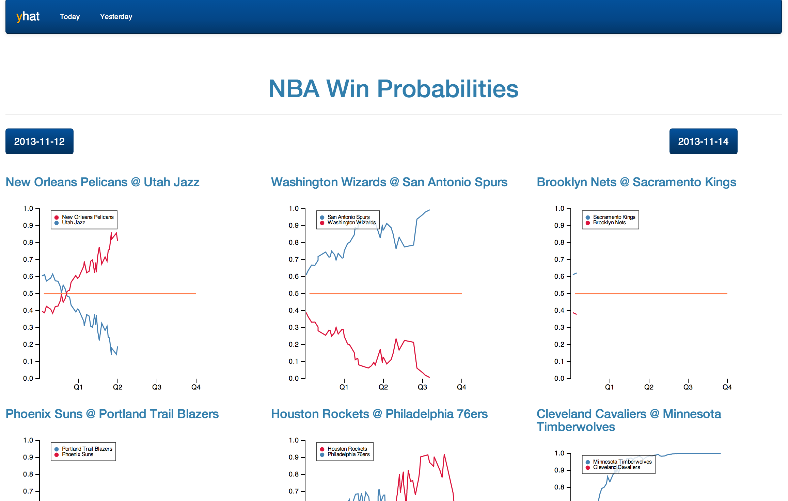
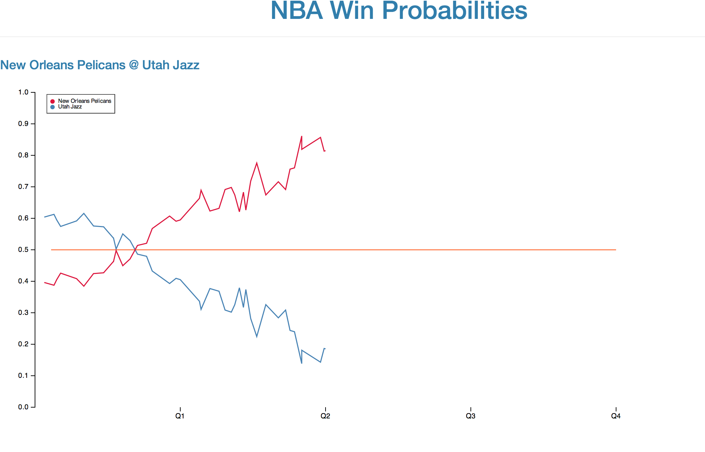

## NBA Win Probability

### Quickstart
- install node js: `brew install node`
- install Postgres: `brew install postgresql`
- create a dev database using Postgres: `psql -U postgres -c "create database dev;"`
- clone the repo: `git clone git@github.com:glamp/nba_predictor.git`
- run the `populate_fake_data.sh` in one terminal window
- run the node app in another

```
export PG_URI=postgres://{USERNAME}:{PASSWORD}@{HOST}/{DBNAME}
node app.js
```

- open [http://localhost:3000](http://localhost:3000)
- *graphs are still a work in progress!*


### Examples




### TODO
- Not scraping time_remaining=0 or final scores
- Not setup to handle overtime
- Add current/final scores and minutes remaining in quarter
